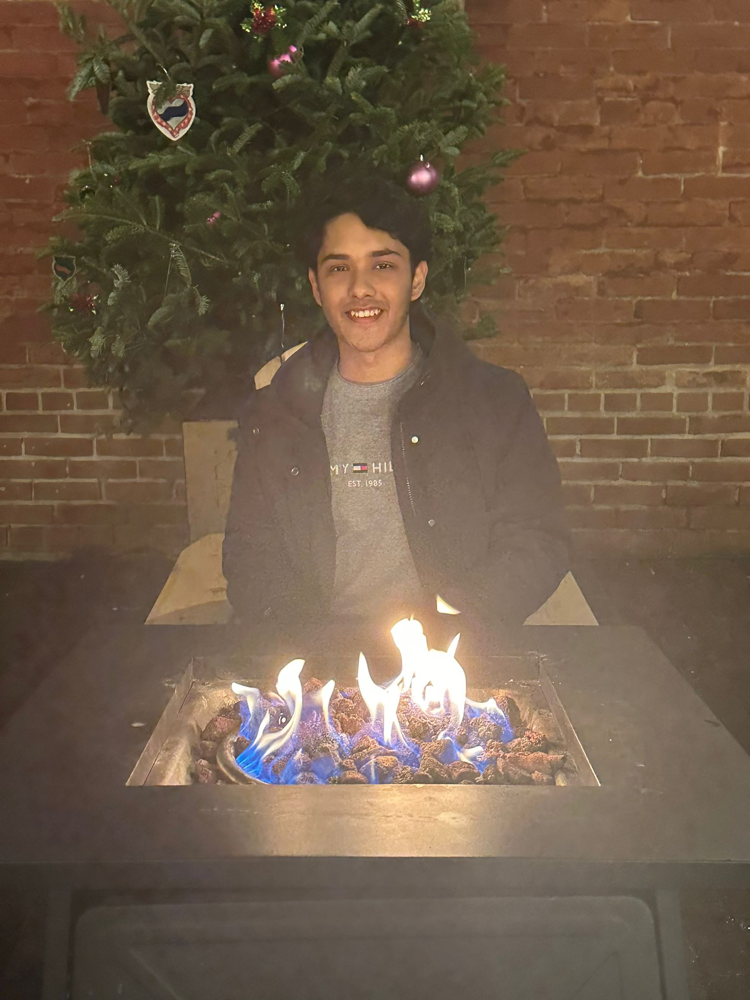

  <b></b>

 

  

## I'm a Second-year Computer Science student at [Toronto Metropolitan University](https://www.torontomu.ca)!!
 

📖 𝙰𝚋𝚘𝚞𝚝 𝙼𝚎
- 💬 A very friendly guy :)
- 🌱 Currently focusing on expanding my skills in JavaScript, React, SQL, R and Git
- ✨ Actively seeking Co-op opportunities and open to taking on any opportunity that can challenge, grow, and improve my skillset!.
- 🥅 2024 Goals: Get an internship and expand my skillset on the following: Cyber Security, Block Chain, Data Science, Statistics, Natural Language Processing, and LLMs
- 💪 My go-to languages are Python and Java
- ⚡️ Fun fact: I LOOOVE TRAVELLING
- 👯 Let's connect! I'm eager to collaborate on exciting projects. You can reach me through nuaiman.hasan@torontomu.ca and nnuaiman@gmail.com

### Connect with me:

[][Facebook]
[][linkedin]
[][instagram]

 

### Languages:

 

### Frameworks & Tools: 

[mail]: nuaiman.hasan@torontomu.ca
[instagram]:https://www.instagram.com/nnnuaimannn/
[linkedin]:https://www.linkedin.com/in/mohammad-nuaiman-hasan-baa0b0154/
[Facebook]:https://www.facebook.com/mohammad.nuaiman/
