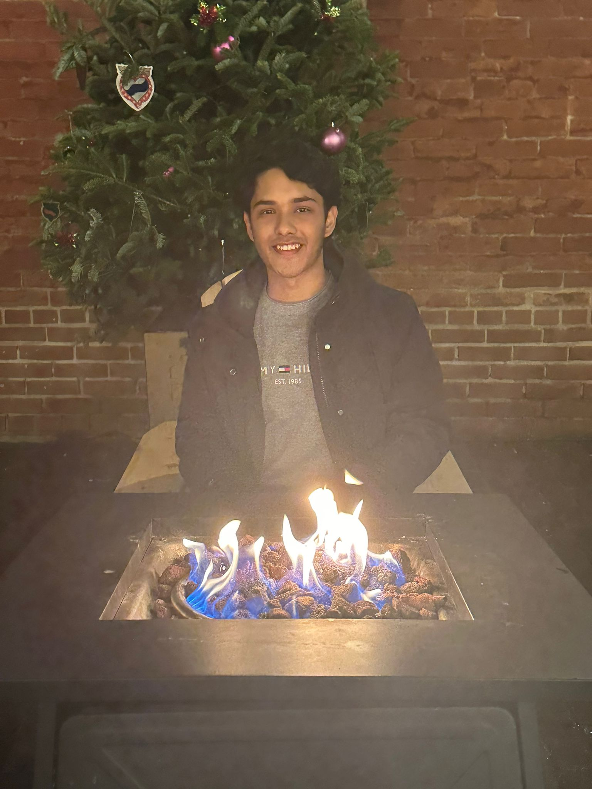

  <b></b>

 

  

## 🎓 Final-year Computer Science (Co-op) student at [Toronto Metropolitan University](https://www.torontomu.ca)

📖 𝙰𝚋𝚘𝚞𝚝 𝙼𝚎
- 💻 Software engineer with hands-on experience building ML pipelines, data platforms, and full-stack applications — most recently at **Celestica** and **Brain Station 23**
- 🧠 Deep interest in **Data Science, System Design, and applied AI/LLMs** — I like taking apart how large systems are built and reasoning about the trade-offs
- 🚀 Actively seeking **New Grad Software Engineering** roles where I can work on hard, ambiguous problems
- 🌱 Currently sharpening: distributed systems fundamentals, Java/Go, and Generative AI tooling (LangChain, RAG pipelines)
- 💪 My go-to languages are **Python, Java, and SQL**
- ⚽ Off-screen, you'll find me watching football, going down philosophy rabbit holes, or queuing up another podcast
- ✈️ Fun fact: I LOOOVE TRAVELLING
- 👯 Let's connect! I'm always up for talking system design, AI, or football — reach me at nuaiman.hasan@torontomu.ca or nnuaiman@gmail.com

### Connect with me:

[][Facebook]
[][linkedin]
[][instagram]

  

[mail]: nuaiman.hasan@torontomu.ca
[instagram]:https://www.instagram.com/nnnuaimannn/
[linkedin]:https://www.linkedin.com/in/mohammad-nuaiman-hasan-baa0b0154/
[Facebook]:https://www.facebook.com/mohammad.nuaiman/
